# FRINKELs Detailed Database Schema Specification

This document provides the full column-level schema definition for every table in the **FRINKELs** Supabase PostgreSQL database.

---

## 🧬 Full Mermaid Entity Relationship Diagram

```mermaid
erDiagram
    profiles {
        uuid id PK
        text email UK
        text full_name
        text name
        text username UK
        text profession
        text bio
        text location
        text location_title
        float latitude
        float longitude
        text avatar_url
        text cover_url
        text_array skills
        text_array interests
        text availability
        boolean email_verified
        boolean is_onboarded
        boolean is_online
        timestamptz last_seen_at
        numeric rating
        integer followers_count
        integer following_count
        integer posts_count
        timestamptz created_at
        timestamptz updated_at
    }

    follows {
        uuid id PK
        uuid follower_id FK
        uuid followed_id FK
        timestamptz created_at
    }

    posts {
        uuid id PK
        uuid author_id FK
        text content
        text_array image_urls
        text type
        integer likes_count
        integer comments_count
        timestamptz created_at
        timestamptz updated_at
    }

    post_likes {
        uuid id PK
        uuid post_id FK
        uuid user_id FK
        timestamptz created_at
    }

    post_bookmarks {
        uuid id PK
        uuid post_id FK
        uuid user_id FK
        timestamptz created_at
    }

    comments {
        uuid id PK
        uuid post_id FK
        uuid author_id FK
        text content
        timestamptz created_at
        timestamptz updated_at
    }

    stories {
        uuid id PK
        uuid user_id FK
        text media_url
        text caption
        text type
        boolean is_viewed
        timestamptz created_at
        timestamptz expires_at
    }

    story_views {
        uuid id PK
        uuid story_id FK
        uuid user_id FK
        timestamptz viewed_at
    }

    businesses {
        uuid id PK
        uuid owner_id FK
        text name
        text description
        text category
        text address
        text phone
        text website
        text image_url
        text cover_image_url
        numeric rating
        integer review_count
        boolean is_open
        boolean is_verified
        timestamptz created_at
        timestamptz updated_at
    }

    categories {
        uuid id PK
        text name UK
        text description
        timestamptz created_at
    }

    communities {
        uuid id PK
        uuid creator_id FK
        text name
        text description
        text category
        integer member_count
        boolean is_verified
        text icon_url
        text banner_url
        timestamptz created_at
        timestamptz updated_at
    }

    community_members {
        uuid id PK
        uuid community_id FK
        uuid user_id FK
        text role
        timestamptz joined_at
    }

    jobs {
        uuid id PK
        uuid posted_by_id FK
        text title
        text company_name
        text company_logo_url
        text description
        text location
        text salary
        numeric salary_min
        numeric salary_max
        text type
        text status
        timestamptz created_at
        timestamptz updated_at
    }

    job_applications {
        uuid id PK
        uuid job_id FK
        uuid applicant_id FK
        uuid user_id FK
        text resume_url
        text cover_letter
        text status
        timestamptz created_at
        timestamptz applied_at
    }

    notifications {
        uuid id PK
        uuid recipient_id FK
        uuid sender_id FK
        text type
        text entity_id
        text entity_type
        boolean is_read
        timestamptz created_at
    }

    conversations {
        uuid id PK
        text type
        text name
        text avatar_url
        timestamptz created_at
        timestamptz updated_at
    }

    conversation_participants {
        uuid id PK
        uuid conversation_id FK
        uuid user_id FK
        text role
        timestamptz joined_at
    }

    messages {
        uuid id PK
        uuid conversation_id FK
        uuid sender_id FK
        text type
        text content
        text_array image_urls
        text video_url
        text file_url
        text voice_url
        text gif_url
        boolean is_gif
        uuid sticker_pack_id
        uuid sticker_id
        boolean pinned
        uuid pinned_by
        timestamptz pinned_at
        uuid edited_by
        timestamptz edited_at
        timestamptz created_at
        timestamptz updated_at
        timestamptz deleted_at
    }

    message_receipts {
        uuid id PK
        uuid message_id FK
        uuid user_id FK
        text status
        timestamptz updated_at
    }

    message_reactions {
        uuid id PK
        uuid message_id FK
        uuid conversation_id FK
        uuid user_id FK
        text emoji
        timestamptz created_at
    }

    typing_indicators {
        uuid id PK
        uuid conversation_id FK
        uuid user_id FK
        boolean is_typing
        timestamptz updated_at
        timestamptz created_at
    }

    profiles ||--o{ follows : "follower / followed"
    profiles ||--o{ posts : "author"
    profiles ||--o{ comments : "author"
    profiles ||--o{ post_likes : "user"
    profiles ||--o{ post_bookmarks : "user"
    profiles ||--o{ stories : "user"
    profiles ||--o{ story_views : "user"
    profiles ||--o{ businesses : "owner"
    profiles ||--o{ communities : "creator"
    profiles ||--o{ community_members : "user"
    profiles ||--o{ jobs : "poster"
    profiles ||--o{ job_applications : "applicant"
    profiles ||--o{ notifications : "recipient / sender"
    profiles ||--o{ conversation_participants : "participant"
    profiles ||--o{ messages : "sender"

    posts ||--o{ comments : "post"
    posts ||--o{ post_likes : "post"
    posts ||--o{ post_bookmarks : "post"

    stories ||--o{ story_views : "story"

    communities ||--o{ community_members : "community"

    jobs ||--o{ job_applications : "job"

    conversations ||--o{ conversation_participants : "conversation"
    conversations ||--o{ messages : "conversation"
    conversations ||--o{ typing_indicators : "conversation"

    messages ||--o{ message_receipts : "message"
    messages ||--o{ message_reactions : "message"
```

---

## 📋 Granular Schema Definitions

### 1. `profiles`
Primary table for storing user profile metadata. Linked to Supabase `auth.users`.

| Column Name | Data Type | Constraints | Default | Description |
|---|---|---|---|---|
| `id` | `UUID` | `PRIMARY KEY`, `REFERENCES auth.users(id) ON DELETE CASCADE` | - | Unique user identifier |
| `email` | `TEXT` | `UNIQUE` | - | User email address |
| `full_name` | `TEXT` | - | - | Full display name |
| `name` | `TEXT` | - | - | Short display name |
| `username` | `TEXT` | `UNIQUE` | - | Handle (@username) |
| `profession` | `TEXT` | - | - | Profession or occupation |
| `bio` | `TEXT` | - | - | Profile biography |
| `location` | `TEXT` | - | - | Location display name |
| `location_title` | `TEXT` | - | - | Custom location heading |
| `latitude` | `DOUBLE PRECISION` | - | - | GPS Latitude |
| `longitude` | `DOUBLE PRECISION` | - | - | GPS Longitude |
| `avatar_url` | `TEXT` | - | - | Avatar photo URL |
| `cover_url` | `TEXT` | - | - | Cover photo URL |
| `skills` | `TEXT[]` | - | `'{}'` | Array of user skill tags |
| `interests` | `TEXT[]` | - | `'{}'` | Array of interest tags |
| `availability` | `TEXT` | - | - | Work availability status |
| `email_verified` | `BOOLEAN` | - | `false` | Email verification flag |
| `is_onboarded` | `BOOLEAN` | - | `false` | Onboarding completion flag |
| `is_online` | `BOOLEAN` | - | `false` | Real-time presence flag |
| `last_seen_at` | `TIMESTAMPTZ` | - | - | Last active timestamp |
| `rating` | `NUMERIC(3,2)` | - | `0.00` | Average professional rating |
| `followers_count` | `INTEGER` | - | `0` | Cached follower count |
| `following_count` | `INTEGER` | - | `0` | Cached following count |
| `posts_count` | `INTEGER` | - | `0` | Cached posts count |
| `created_at` | `TIMESTAMPTZ` | - | `NOW()` | Creation timestamp |
| `updated_at` | `TIMESTAMPTZ` | - | `NOW()` | Last update timestamp |

### 2. `follows`
Represents directed social follow connections between profiles.

| Column Name | Data Type | Constraints | Default | Description |
|---|---|---|---|---|
| `id` | `UUID` | `PRIMARY KEY` | `gen_random_uuid()` | Unique relationship ID |
| `follower_id` | `UUID` | `REFERENCES profiles(id) ON DELETE CASCADE` | - | User following |
| `followed_id` | `UUID` | `REFERENCES profiles(id) ON DELETE CASCADE` | - | User being followed |
| `created_at` | `TIMESTAMPTZ` | - | `NOW()` | Timestamp follow occurred |

### 3. `posts`
Stores main social feed content.

| Column Name | Data Type | Constraints | Default | Description |
|---|---|---|---|---|
| `id` | `UUID` | `PRIMARY KEY` | `gen_random_uuid()` | Post ID |
| `author_id` | `UUID` | `REFERENCES profiles(id) ON DELETE CASCADE` | - | Author user ID |
| `content` | `TEXT` | `NOT NULL` | `''` | Post body text |
| `image_urls` | `TEXT[]` | - | `'{}'` | Attached image URLs |
| `type` | `TEXT` | `CHECK (type IN ('text', 'image', 'video', 'link', 'poll'))` | `'text'` | Post classification |
| `likes_count` | `INTEGER` | - | `0` | Cached total likes |
| `comments_count` | `INTEGER` | - | `0` | Cached total comments |
| `created_at` | `TIMESTAMPTZ` | - | `NOW()` | Post creation time |
| `updated_at` | `TIMESTAMPTZ` | - | `NOW()` | Post edit time |

### 4. `post_likes` & `post_bookmarks`
Junction tables for liking and bookmarking posts.

| Column Name | Data Type | Constraints | Default | Description |
|---|---|---|---|---|
| `id` | `UUID` | `PRIMARY KEY` | `gen_random_uuid()` | Row ID |
| `post_id` | `UUID` | `REFERENCES posts(id) ON DELETE CASCADE` | - | Target post |
| `user_id` | `UUID` | `REFERENCES profiles(id) ON DELETE CASCADE` | - | Target user |
| `created_at` | `TIMESTAMPTZ` | - | `NOW()` | Interaction timestamp |

### 5. `conversations` & `messages`
Core tables supporting realtime direct and group messaging.

| Column Name | Data Type | Constraints | Default | Description |
|---|---|---|---|---|
| `id` | `UUID` | `PRIMARY KEY` | `gen_random_uuid()` | Message ID |
| `conversation_id` | `UUID` | `REFERENCES conversations(id) ON DELETE CASCADE` | - | Parent conversation |
| `sender_id` | `UUID` | `REFERENCES profiles(id) ON DELETE CASCADE` | - | Message sender |
| `type` | `TEXT` | - | `'text'` | Message type |
| `content` | `TEXT` | - | - | Text content |
| `image_urls` | `TEXT[]` | - | `'{}'` | Image attachments |
| `video_url` | `TEXT` | - | - | Video attachment |
| `voice_url` | `TEXT` | - | - | Voice note attachment |
| `file_url` | `TEXT` | - | - | Document attachment |
| `pinned` | `BOOLEAN` | - | `false` | Pin status |
| `pinned_by` | `UUID` | `REFERENCES profiles(id)` | - | User who pinned message |
| `created_at` | `TIMESTAMPTZ` | - | `NOW()` | Timestamp sent |
