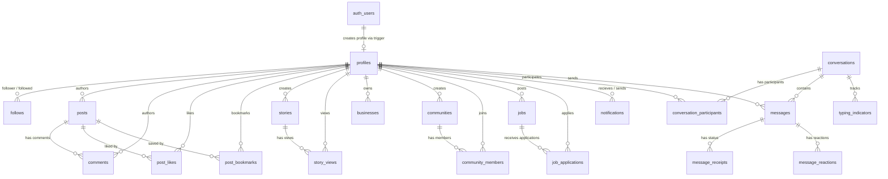

# FRINKELs Supabase Database Architecture & Governance Guide

Welcome to the official database documentation for **FRINKELs** — the hyperlocal professional discovery platform.

---

## 📌 Database Architecture Overview

FRINKELs relies on **Supabase** (PostgreSQL 15+) as its backend data store. The database layer is designed for high scalability, real-time messaging, geospatial querying, and robust row-level security (RLS).

### Core Principles
1. **Clean Architecture & Feature Isolation**: Database tables map cleanly to Flutter feature domains (`auth`, `profile`, `home`, `chat`, `jobs`, `notifications`, `search`).
2. **Immutability & Non-Destructive Migrations**: Production migrations strictly append structures using `CREATE TABLE IF NOT EXISTS`, `ALTER TABLE ... ADD COLUMN IF NOT EXISTS`, preserving existing data and indexes.
3. **Data Integrity & Relational Constraints**: All foreign keys enforce cascades or set-null constraints to avoid orphan records.
4. **Row Level Security (RLS)**: Every single table enforces default-deny RLS policies. Users can only read public data or write their own authored resources.
5. **Real-time Engine**: Postgres change data capture (CDC) is enabled for messaging (`messages`, `conversations`, `typing_indicators`, `message_reactions`).

---

## 🗄️ Master Table Inventory

| # | Table / View | Description | Key Relationships | RLS Policy |
|---|---|---|---|---|
| 1 | `profiles` | Core user identity & professional profile | FK -> `auth.users` | Public read, owner write |
| 2 | `follows` | Follower/following network | FK -> `profiles` (follower, followed) | Public read, self write/delete |
| 3 | `posts` | Feed posts & content | FK -> `profiles` (author) | Public read, author write/delete |
| 4 | `post_likes` | Post likes tracking | FK -> `posts`, `profiles` | Public read, owner write/delete |
| 5 | `post_bookmarks` | Saved/bookmarked posts | FK -> `posts`, `profiles` | Owner read/write/delete |
| 6 | `comments` | Post comments | FK -> `posts`, `profiles` | Public read, author write/delete |
| 7 | `stories` | 24-hour expiring media stories | FK -> `profiles` | Non-expired read, owner write/delete |
| 8 | `story_views` | Unique story view logs | FK -> `stories`, `profiles` | Owner/Author read, self insert |
| 9 | `businesses` | Local business directory listings | FK -> `profiles` (owner) | Public read, owner write |
| 10 | `categories` | Business & job master categories | Unique `name` | Public read |
| 11 | `communities` | Hyperlocal groups & interest circles | FK -> `profiles` (creator) | Public read, creator write |
| 12 | `community_members` | Community membership tracking | FK -> `communities`, `profiles` | Public read, self join/leave |
| 13 | `jobs` | Local job postings | FK -> `profiles` (posted_by) | Public read, poster write |
| 14 | `job_applications` | Job applications & resume uploads | FK -> `jobs`, `profiles` | Applicant/Poster read, self apply |
| 15 | `notifications` | User notification center | FK -> `profiles` (recipient, sender) | Recipient read/update/delete |
| 16 | `local_news` | Geo-tagged news feed | Categorized by location | Public read |
| 17 | `search_trending` | Aggregated search term analytics | Unique `query` | Public read |
| 18 | `user_searches` | Individual user search history | FK -> `profiles` | Owner read/write/delete |
| 19 | `conversations` | Individual & group chat sessions | Direct & Group Types | Participants only |
| 20 | `conversation_participants` | Chat membership & roles | FK -> `conversations`, `profiles` | Participants only |
| 21 | `messages` | Chat messages with media & geo | FK -> `conversations`, `profiles` | Participants read/insert, sender edit |
| 22 | `message_receipts` | Message delivery & read receipts | FK -> `messages`, `profiles` | Participants read, recipient write |
| 23 | `message_reactions` | Emoji reactions per message | FK -> `messages`, `profiles` | Participants read, self react/delete |
| 24 | `typing_indicators` | Real-time chat typing status | FK -> `conversations`, `profiles` | Participants read, self update |
| 25 | `likes` *(View)* | Compatibility view over `post_likes` | Aliases `post_likes` | Inherits base table RLS |
| 26 | `bookmarks` *(View)*| Compatibility view over `post_bookmarks` | Aliases `post_bookmarks` | Inherits base table RLS |

---

## ⚡ Stored Procedures (RPC Functions)

### 1. `get_suggested_profiles(user_id UUID, limit INT)`
- **Purpose**: Returns suggested professionals for a given user based on popularity and connections, excluding users already followed.
- **Parameters**: `user_id` (UUID), `limit` (INTEGER DEFAULT 10)
- **Returns**: `SETOF profiles`

### 2. `get_nearby_profiles(user_id UUID, latitude FLOAT, longitude FLOAT, radius_km FLOAT, limit INT)`
- **Purpose**: Uses the Haversine formula to compute spatial distance between `(latitude, longitude)` and all onboarded profiles within `radius_km`.
- **Parameters**: `user_id` (UUID), `latitude` (FLOAT), `longitude` (FLOAT), `radius_km` (FLOAT DEFAULT 10.0), `limit` (INTEGER DEFAULT 20)
- **Returns**: `SETOF profiles` sorted by proximity distance.

---

## 🪣 Storage Buckets Configuration

| Bucket Name | Privacy Level | Max File Size | Allowed MIME Types | Purpose |
|---|---|---|---|---|
| `profile_photos` | **Public** | 5 MB | `image/jpeg`, `image/png`, `image/webp` | User avatars |
| `cover_photos` | **Public** | 10 MB | `image/jpeg`, `image/png`, `image/webp` | Profile banner covers |
| `chat_attachments` | **Private** | 50 MB | `image/*`, `video/*`, `audio/*`, `application/*` | Chat media & voice notes |
| `post_media` | **Public** | 25 MB | `image/*`, `video/*` | Post attachments |
| `job_resumes` | **Private** | 15 MB | `application/pdf`, `application/msword` | PDF/Doc resumes |
| `uploads` | **Public** | 20 MB | Any image/document | General temporary uploads |

---

## 🔄 Automated Triggers & Counter Caches

1. **`on_auth_user_created`**: Automatically inserts a `profiles` record whenever a new user registers in Supabase `auth.users`.
2. **`update_updated_at_column()`**: Standardized trigger applied to `profiles`, `posts`, `businesses`, `communities`, `jobs` to auto-set `updated_at = NOW()`.
3. **`on_follow_change`**: Increments/decrements `followers_count` and `following_count` on `profiles` upon insert/delete in `follows`.
4. **`on_post_change`**: Increments/decrements `posts_count` on `profiles` upon insert/delete in `posts`.
5. **`on_post_like_change`**: Increments/decrements `likes_count` on `posts` upon insert/delete in `post_likes`.
6. **`on_comment_change`**: Increments/decrements `comments_count` on `posts` upon insert/delete in `comments`.

---

## 📐 Entity Relationship (ER) Diagram

---

## 📂 Migration Files Reference

All migrations are located in `supabase/migrations/`:
- [`202608010001_create_chat_schema.sql`](file:///c:/Users/SATYAM%20PANDAY/StudioProjects/frinkels/supabase/migrations/202608010001_create_chat_schema.sql)
- [`20260803150922_add_chat_enhancements.sql`](file:///c:/Users/SATYAM%20PANDAY/StudioProjects/frinkels/supabase/migrations/20260803150922_add_chat_enhancements.sql)
- [`20260803152000_add_chat_features.sql`](file:///c:/Users/SATYAM%20PANDAY/StudioProjects/frinkels/supabase/migrations/20260803152000_add_chat_features.sql)
- [`20260803160000_core_platform_schema.sql`](file:///c:/Users/SATYAM%20PANDAY/StudioProjects/frinkels/supabase/migrations/20260803160000_core_platform_schema.sql)
- [`20260803161000_rpc_functions_views_triggers.sql`](file:///c:/Users/SATYAM%20PANDAY/StudioProjects/frinkels/supabase/migrations/20260803161000_rpc_functions_views_triggers.sql)
- [`20260803162000_rls_policies_and_storage.sql`](file:///c:/Users/SATYAM%20PANDAY/StudioProjects/frinkels/supabase/migrations/20260803162000_rls_policies_and_storage.sql)
