# FRINKELs — Entity-Relationship Diagram

> **Schema Version**: 2026-08-04
> **Migration chain**: 14 files in `supabase/migrations/`

This Mermaid ER diagram visualizes every public schema table and its foreign-key relationships.

```mermaid
erDiagram
    auth_users ||--|| profiles : "id (CASCADE)"
    profiles ||--o{ follows : "follower_id / followed_id"
    profiles ||--o{ posts : "author_id"
    profiles ||--o{ post_likes : "user_id"
    profiles ||--o{ post_bookmarks : "user_id"
    profiles ||--o{ comments : "author_id"
    profiles ||--o{ stories : "user_id"
    profiles ||--o{ story_views : "user_id"
    profiles ||--o{ businesses : "owner_id (SET NULL)"
    profiles ||--o{ communities : "creator_id (SET NULL)"
    profiles ||--o{ community_members : "user_id"
    profiles ||--o{ jobs : "posted_by_id"
    profiles ||--o{ job_applications : "applicant_id / user_id"
    profiles ||--o{ notifications : "recipient_id / sender_id"
    profiles ||--o{ user_searches : "user_id"

    posts ||--o{ post_likes : "post_id (CASCADE)"
    posts ||--o{ post_bookmarks : "post_id (CASCADE)"
    posts ||--o{ comments : "post_id (CASCADE)"

    stories ||--o{ story_views : "story_id (CASCADE)"

    communities ||--o{ community_members : "community_id (CASCADE)"

    jobs ||--o{ job_applications : "job_id (CASCADE)"

    conversations ||--o{ conversation_participants : "conversation_id"
    conversations ||--o{ messages : "conversation_id"
    conversations ||--o{ typing_indicators : "conversation_id"

    profiles ||--o{ conversation_participants : "user_id"
    profiles ||--o{ messages : "sender_id / edited_by / pinned_by"
    profiles ||--o{ message_receipts : "user_id"
    profiles ||--o{ message_reactions : "user_id"
    profiles ||--o{ typing_indicators : "user_id"

    messages ||--o{ message_receipts : "message_id"
    messages ||--o{ message_reactions : "message_id"
    messages ||--o| messages : "reply_to / forwarded_from (SET NULL)"

    profiles {
        UUID id PK "FK -> auth.users.id"
        TEXT email UK
        TEXT username UK
        TEXT full_name
        TEXT name
        TEXT profession
        TEXT bio
        TEXT location
        TEXT location_title
        DOUBLE_PRECISION latitude
        DOUBLE_PRECISION longitude
        TEXT avatar_url
        TEXT cover_url
        TEXT_ARRAY skills
        TEXT_ARRAY interests
        TEXT availability
        BOOLEAN email_verified
        BOOLEAN is_onboarded
        BOOLEAN is_online
        TIMESTAMPTZ last_seen_at
        TIMESTAMPTZ last_activity
        TIMESTAMPTZ status_updated_at
        NUMERIC rating
        INTEGER followers_count
        INTEGER following_count
        INTEGER posts_count
        TIMESTAMPTZ created_at
        TIMESTAMPTZ updated_at
    }

    follows {
        UUID id PK
        UUID follower_id FK
        UUID followed_id FK
        TIMESTAMPTZ created_at
    }

    posts {
        UUID id PK
        UUID author_id FK
        TEXT content
        TEXT_ARRAY image_urls
        TEXT type "CHECK text|image|video|link|poll"
        post_visibility visibility
        INTEGER likes_count
        INTEGER comments_count
        TIMESTAMPTZ created_at
        TIMESTAMPTZ updated_at
    }

    post_likes {
        UUID id PK
        UUID post_id FK
        UUID user_id FK
        TIMESTAMPTZ created_at
    }

    post_bookmarks {
        UUID id PK
        UUID post_id FK
        UUID user_id FK
        TIMESTAMPTZ created_at
    }

    comments {
        UUID id PK
        UUID post_id FK
        UUID author_id FK
        TEXT content
        TIMESTAMPTZ created_at
        TIMESTAMPTZ updated_at
    }

    stories {
        UUID id PK
        UUID user_id FK
        TEXT media_url
        TEXT caption
        TEXT type "CHECK image|video"
        story_visibility visibility
        BOOLEAN is_viewed
        TIMESTAMPTZ created_at
        TIMESTAMPTZ expires_at
    }

    story_views {
        UUID id PK
        UUID story_id FK
        UUID user_id FK
        TIMESTAMPTZ viewed_at
    }

    categories {
        UUID id PK
        TEXT name UK
        TEXT description
        TIMESTAMPTZ created_at
    }

    businesses {
        UUID id PK
        UUID owner_id FK
        TEXT name
        TEXT description
        business_category category
        TEXT address
        TEXT phone
        TEXT website
        TEXT image_url
        TEXT cover_image_url
        NUMERIC rating
        INTEGER review_count
        BOOLEAN is_open
        BOOLEAN is_verified
        TIMESTAMPTZ created_at
        TIMESTAMPTZ updated_at
    }

    communities {
        UUID id PK
        UUID creator_id FK
        TEXT name
        TEXT description
        TEXT category
        community_visibility visibility
        INTEGER member_count
        BOOLEAN is_verified
        TEXT icon_url
        TEXT banner_url
        TIMESTAMPTZ created_at
        TIMESTAMPTZ updated_at
    }

    community_members {
        UUID id PK
        UUID community_id FK
        UUID user_id FK
        user_role role
        TIMESTAMPTZ joined_at
    }

    jobs {
        UUID id PK
        UUID posted_by_id FK
        TEXT title
        TEXT company_name
        TEXT company_logo_url
        TEXT description
        TEXT location
        TEXT salary
        NUMERIC salary_min
        NUMERIC salary_max
        TEXT type
        job_status status
        TIMESTAMPTZ created_at
        TIMESTAMPTZ updated_at
    }

    job_applications {
        UUID id PK
        UUID job_id FK
        UUID applicant_id FK
        UUID user_id FK
        TEXT resume_url
        TEXT cover_letter
        application_status status
        TIMESTAMPTZ created_at
        TIMESTAMPTZ applied_at
    }

    notifications {
        UUID id PK
        UUID recipient_id FK
        UUID sender_id FK
        notification_type type
        TEXT entity_id
        TEXT entity_type
        BOOLEAN is_read
        TIMESTAMPTZ created_at
    }

    local_news {
        UUID id PK
        TEXT title
        TEXT description
        TEXT image_url
        TEXT source
        TEXT author
        TEXT category
        TEXT location
        TIMESTAMPTZ published_at
        BOOLEAN is_trending
        TIMESTAMPTZ created_at
    }

    search_trending {
        UUID id PK
        TEXT query UK
        TEXT category
        INTEGER search_count
        TIMESTAMPTZ updated_at
    }

    user_searches {
        UUID id PK
        UUID user_id FK
        TEXT query
        TIMESTAMPTZ created_at
    }

    conversations {
        UUID id PK
        conversation_type type
        TEXT name
        TEXT avatar_url
        TIMESTAMPTZ created_at
        TIMESTAMPTZ updated_at
    }

    conversation_participants {
        UUID id PK
        UUID conversation_id FK
        UUID user_id FK
        user_role role
        TIMESTAMPTZ joined_at
    }

    messages {
        UUID id PK
        UUID conversation_id FK
        UUID sender_id FK
        message_type type
        TEXT content
        TEXT_ARRAY image_urls
        TEXT video_url
        TEXT file_url
        TEXT voice_url
        TEXT gif_url
        BOOLEAN is_gif
        INTEGER duration
        DOUBLE_PRECISION latitude
        DOUBLE_PRECISION longitude
        TEXT location_title
        JSONB contact_data
        UUID reply_to_message_id FK
        UUID forwarded_from_message_id FK
        TIMESTAMPTZ edited_at
        UUID edited_by FK
        UUID sticker_pack_id
        UUID sticker_id
        BOOLEAN pinned
        UUID pinned_by FK
        TIMESTAMPTZ pinned_at
        TIMESTAMPTZ created_at
        TIMESTAMPTZ updated_at
        TIMESTAMPTZ deleted_at
        UUID_ARRAY deleted_by
    }

    message_receipts {
        UUID id PK
        UUID message_id FK
        UUID user_id FK
        TEXT status "CHECK delivered|read"
        TIMESTAMPTZ updated_at
    }

    message_reactions {
        UUID id PK
        UUID message_id FK
        UUID conversation_id FK
        UUID user_id FK
        TEXT emoji
        TIMESTAMPTZ created_at
    }

    typing_indicators {
        UUID id PK
        UUID conversation_id FK
        UUID user_id FK
        BOOLEAN is_typing
        TIMESTAMPTZ started_at
        TIMESTAMPTZ expires_at
        TIMESTAMPTZ created_at
        TIMESTAMPTZ updated_at
    }
```

---

## ENUMs Reference

| Enum | Values | Tables that use it |
|------|--------|-------------------|
| `job_status` | draft, open, filled, completed, cancelled, closed | `jobs.status` |
| `message_type` | text, image, video, voice, file, location, contact, sticker, gif | `messages.type` |
| `conversation_type` | individual, group | `conversations.type` |
| `notification_type` | like, comment, mention, follow, mention_in_comment, post_mention, job_application, job_accepted, job_rejected, event_invite, event_reminder, system | `notifications.type` |
| `application_status` | pending, reviewed, accepted, rejected | `job_applications.status` |
| `user_role` | admin, moderator, member | `community_members.role`, `conversation_participants.role` |
| `business_category` | food, retail, services, health, education, technology, entertainment, other | `businesses.category` |
| `community_visibility` | public, private, invite_only | `communities.visibility` |
| `story_visibility` | public, followers, close_friends | `stories.visibility` |
| `post_visibility` | public, followers, private | `posts.visibility` |

---

## Views Reference

| View | Backed by | Writable? |
|------|-----------|-----------|
| `public.likes` | `post_likes` | Yes — INSTEAD OF INSERT/UPDATE/DELETE triggers |
| `public.bookmarks` | `post_bookmarks` | Yes — INSTEAD OF INSERT/UPDATE/DELETE triggers |
| `public.enum_catalog` | `pg_type` introspection | Yes (read-only used in practice) |

---

**See [[DATABASE_AUDIT]] for context, [[MIGRATION_DEPENDENCY]] for creation order, [[BACKEND_COVERAGE]] for Flutter mapping, [[ENUMS]] for enum details.**
